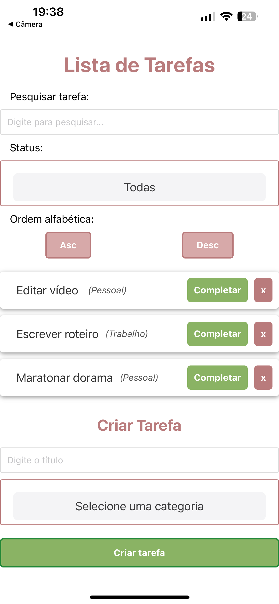

## Programação para Dispositivos Móveis 

Esse projeto é a continuação da versão desktop do ToDo List (voce pode visualizar essa versão neste repositório aqui = https://github.com/malummartiins/todo)

A idéia deste projeto é transformar uma aplicação já existente em uma versão mobile - IOs | Atendendo aos requisitos da disciplina do curso de ADS da Unisinos.
Essa aplicação é o projeto final da cadeira de programação para dispositivos móveis.

O projeto ficou com uma aplicação simples e pode ser visualizado atravez do app Expo.

# Funcionalidades:
- O usuário pode pesquisar por tarefas com qualquer nome;
- Visualizar por tarefas completas, incompletas ou todas;
- Ver elas em ordem alfabética (asc ou desc);
- Uma lista com as tarefas criadas e botoes para completar ou remover;
- O aplicativo ja vem por padrão com 3 tarefas criadas, ali voce já pode experimentar as funcionalidades dele.
- E a última seção é a area em que se cria uma tarefa.

